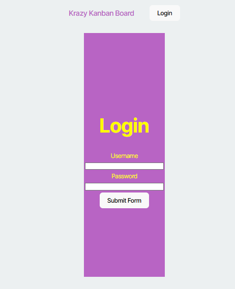
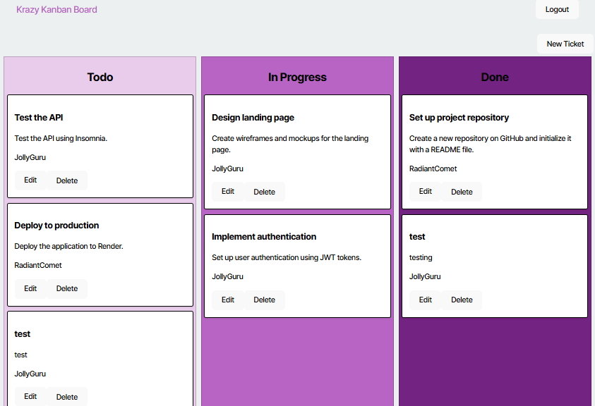

# Kool Kanban Board

## Description
The Kool Kanban Board application is a full-stack aplication that incorporates React, JWTs, API, TypeScript, PostgreSQL to call process the application's. This application allows the user to securely login Kanban Board using a username and password, from there the user able to manage their Kanban board by creating new tickets to add to the user TODO task, can also manage the task by marking them within a "In progress" status, and lastly the user able to mark the task "Done" once completed.

Once the user finished managing their Kanban board they can "Logout" and the application redirect to the application's landing home page. 






## Installation
```
The Installation entails using React, JWTs, API, TypeScript, PostgreSQL, Github, Render

## Usage
```
The usage of this application allows users to securely login Kanban Board using a username and password, from there the user able to manage their Kanban board by creating new tickets to add to the user TODO task, can also manage the task by marking them within a "In progress" status, and lastly the user able to mark the task "Done" once completed.
```
## Contributing

Users can contact me to discuss any further advice, input and or collboration efforts for team building opportunites. 

## Tests
```test included running terminal commands NPM I, NPM run build, NPM run seed, and NPM run start for the application website to launch open to be able to view the Kanban Board login secure login page, to create new tickets for new TODO task to manage.  
```

## Contact and Github information

For any questions, contact me at [via Email](mailto:dreamgardens24@gmail.com).  
GitHub: [Miyako24](https://github.com/Miyako24/Krazy-Kool-Kanban) # Krazy-Kool-Kanban
Render: [Miyako24](https://api-candidate-search.onrender.com) # Krazy-Kool-Kanban